# ASCS Codex Visual Reference

These desktop screenshots are the canonical visual reference for the current
ASCS interface. Every image is local, deterministic, fictional, Corporate
theme, device scale factor 1, and browser zoom 100%. Screenshots 01–14 use a
1440x900 viewport; screenshots 15–16 are full-page captures at 1440px width so
the complete printable and not-approved evidence remains visible. The
screenshot script waits for the primary screen state before capture.

## Login

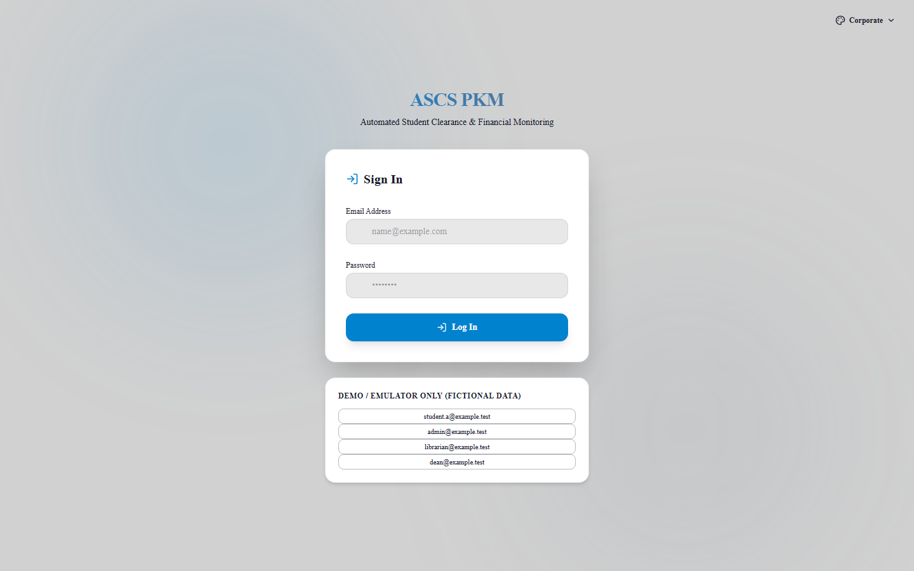

Route: `/login`
Role: public sign-in
Fixture: fictional emulator accounts
Theme: Corporate
Viewport: 1440x900
Purpose: Shows the accessible sign-in form, emulator-only fictional account
selector, and the boundary that keeps the selector off the public Vercel demo.

## Approved Student Dashboard

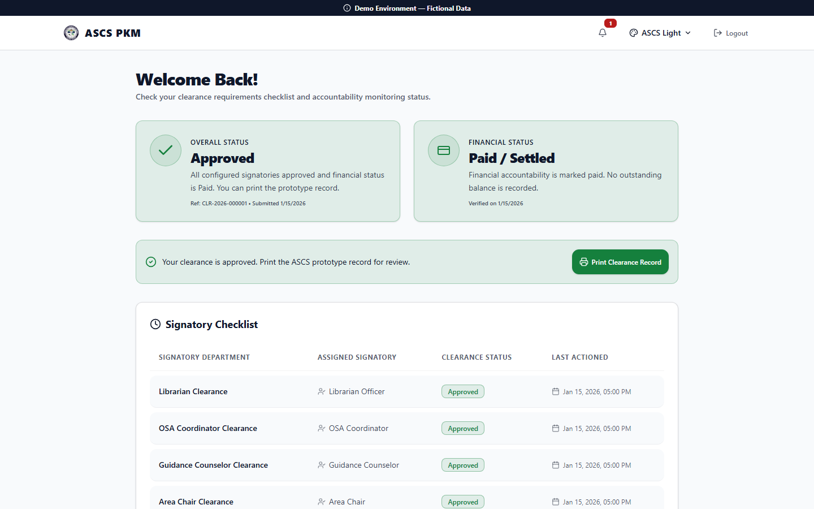

Route: `/student/dashboard`
Role: Student
Fixture: Student A, approved + paid (BSAIS - Accounting Information System)
Theme: Corporate
Viewport: 1440x900
Purpose: Shows cleared status and print action.

## Pending Student Dashboard

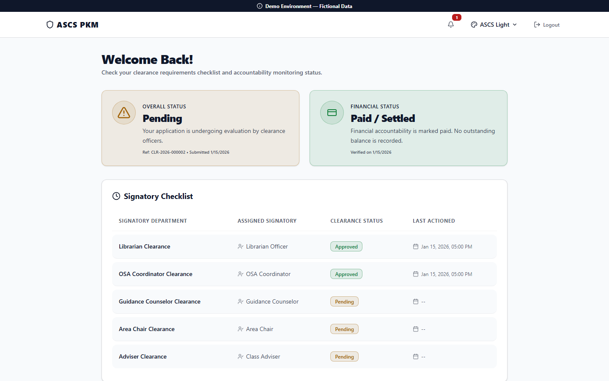

Route: `/student/dashboard`
Role: Student
Fixture: Student B, two approvals and three pending (BSMA - Management Accounting)
Theme: Corporate
Viewport: 1440x900
Purpose: Shows progress tracking and unavailable print output.

## Student Submission

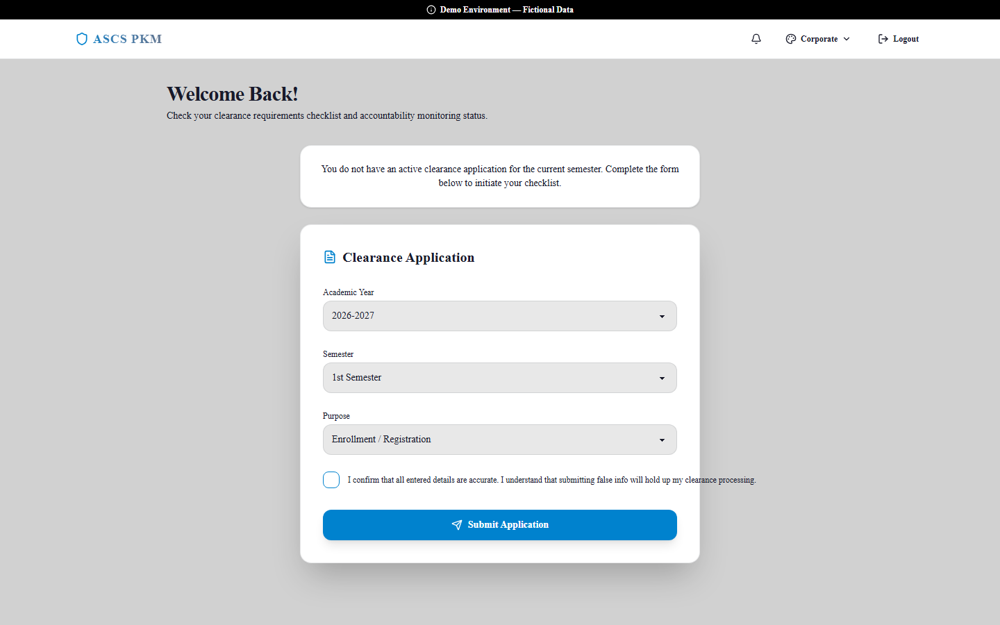

Route: `/student/dashboard`
Role: Student
Fixture: Student G, active with no application (FSM - Food Service Management)
Theme: Corporate
Viewport: 1440x900
Purpose: Shows the new clearance submission form.

## Signatory Dashboard

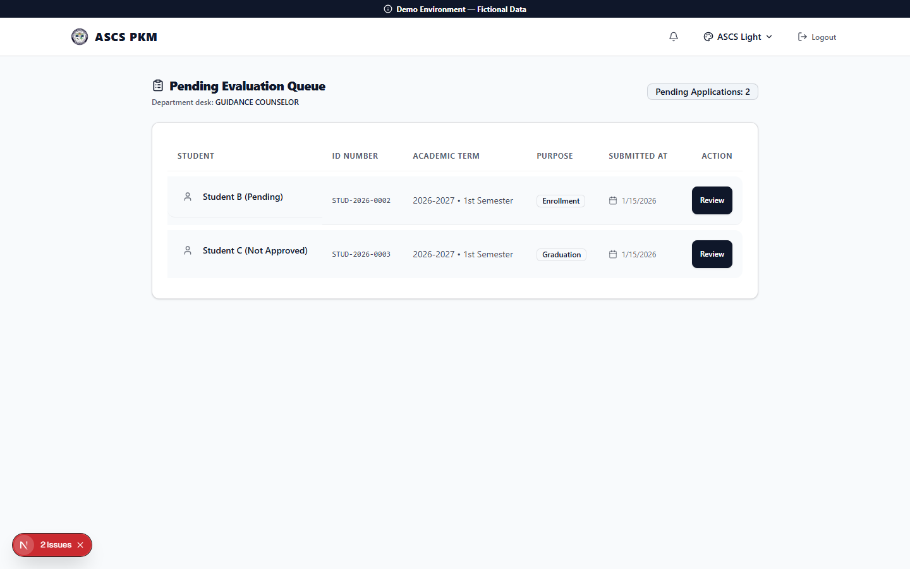

Route: `/guidance_counselor/dashboard`
Role: Guidance Counselor
Fixture: deterministic pending queue
Theme: Corporate
Viewport: 1440x900
Purpose: Shows the role-scoped evaluation queue.

## Signatory Review Dialog

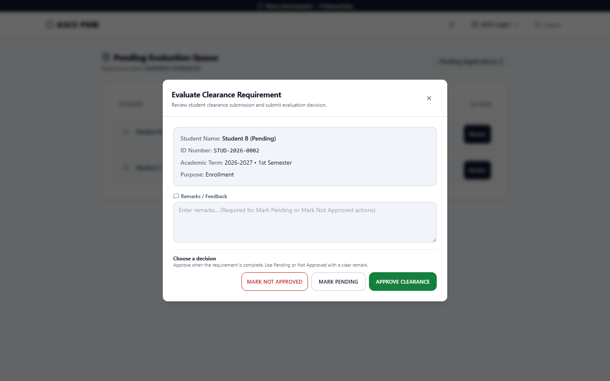

Route: `/guidance_counselor/dashboard`
Role: Guidance Counselor
Fixture: first pending queue record, Review dialog open
Theme: Corporate
Viewport: 1440x900
Purpose: Shows the readable review context, remarks requirement, and the three clearly differentiated clearance actions.

## Accountant Dashboard

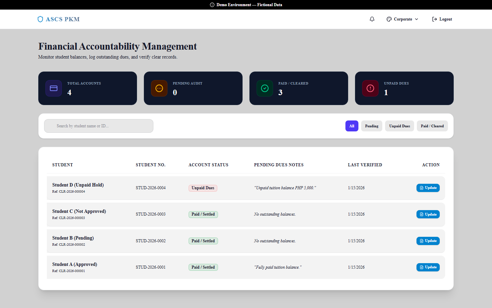

Route: `/accountant/dashboard`
Role: Accountant
Fixture: financial queue containing paid and unpaid examples
Theme: Corporate
Viewport: 1440x900
Purpose: Shows financial accountability monitoring.

## Accountant Financial Dialog

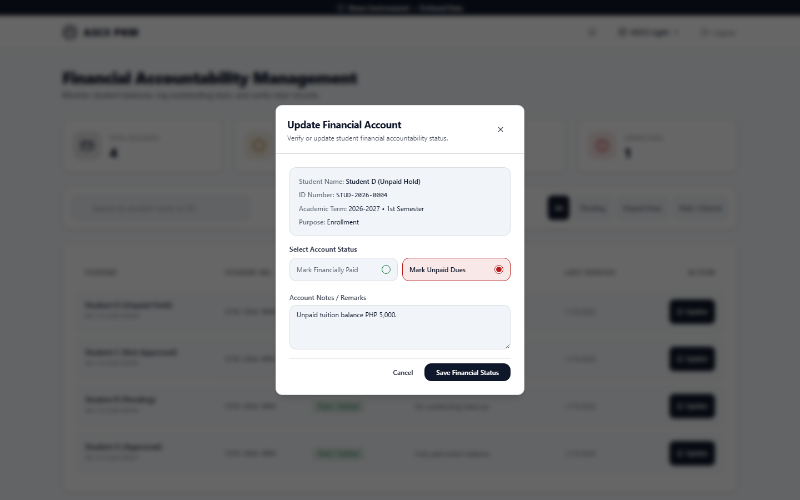

Route: `/accountant/dashboard`
Role: Accountant
Fixture: first financial queue record, Update dialog open
Theme: Corporate
Viewport: 1440x900
Purpose: Shows the separate paid/unpaid gate.

## Dean Clearance Queue

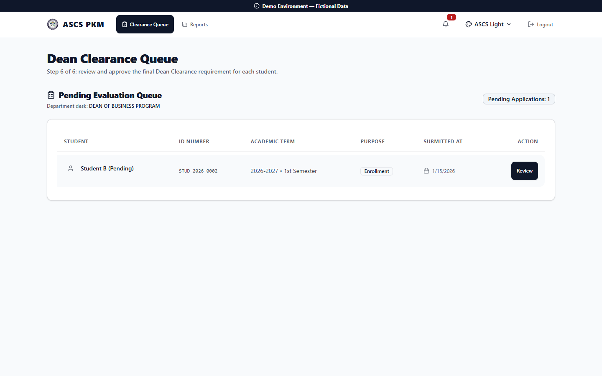

Route: `/dean/dashboard`
Role: Dean
Fixture: pending Dean approval queue
Theme: Corporate
Viewport: 1440x900
Purpose: Shows the actionable sixth-stage Dean queue (the fifth signatory row).

## Dean Review Dialog

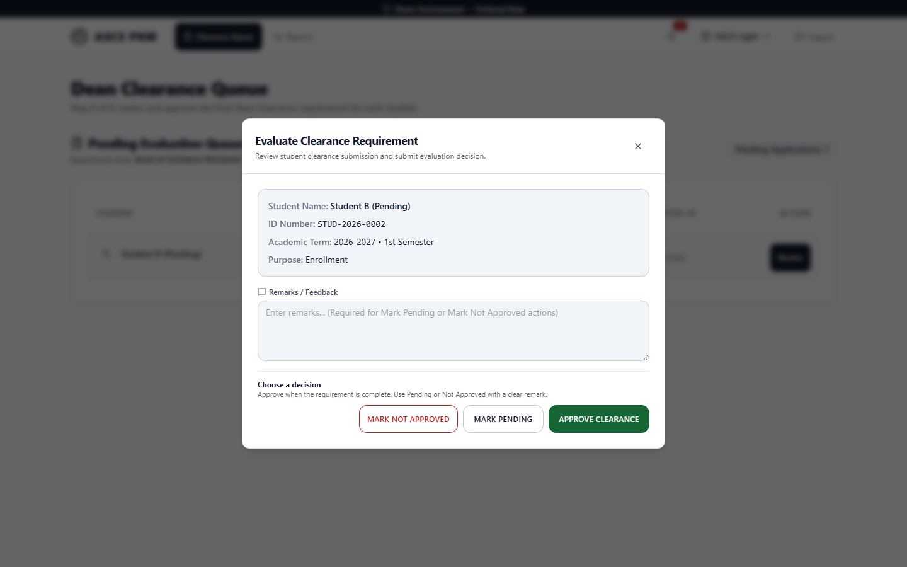

Route: `/dean/dashboard`
Role: Dean
Fixture: Dean Clearance review dialog
Theme: Corporate
Viewport: 1440x900
Purpose: Shows Dean approve/pending/not-approved actions.

## Admin Overview

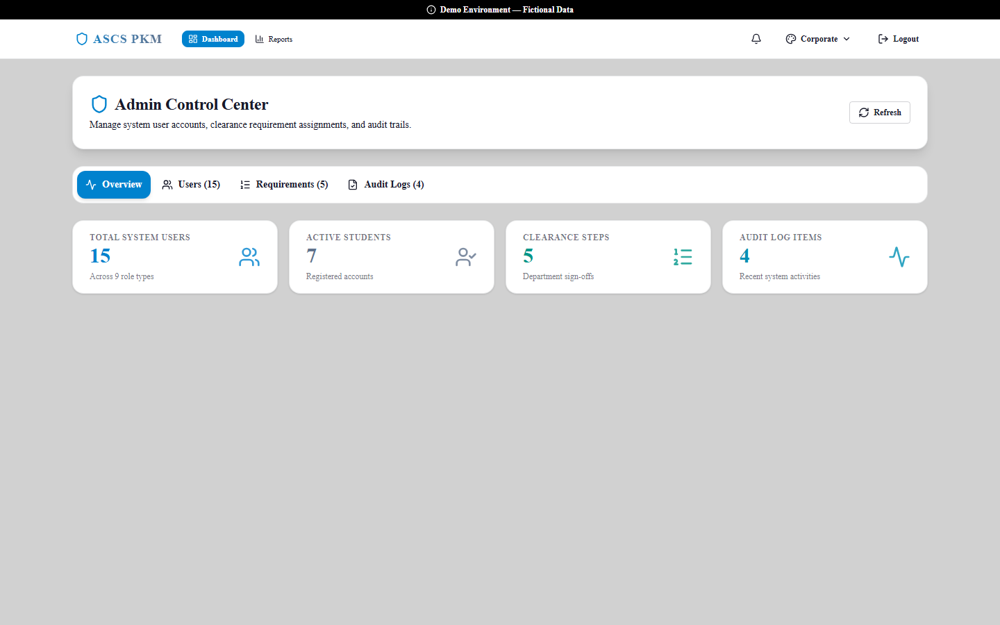

Route: `/admin/dashboard`
Role: System Administrator
Fixture: seeded users, requirements, and logs
Theme: Corporate
Viewport: 1440x900
Purpose: Shows institution administration overview.

## Admin User Management

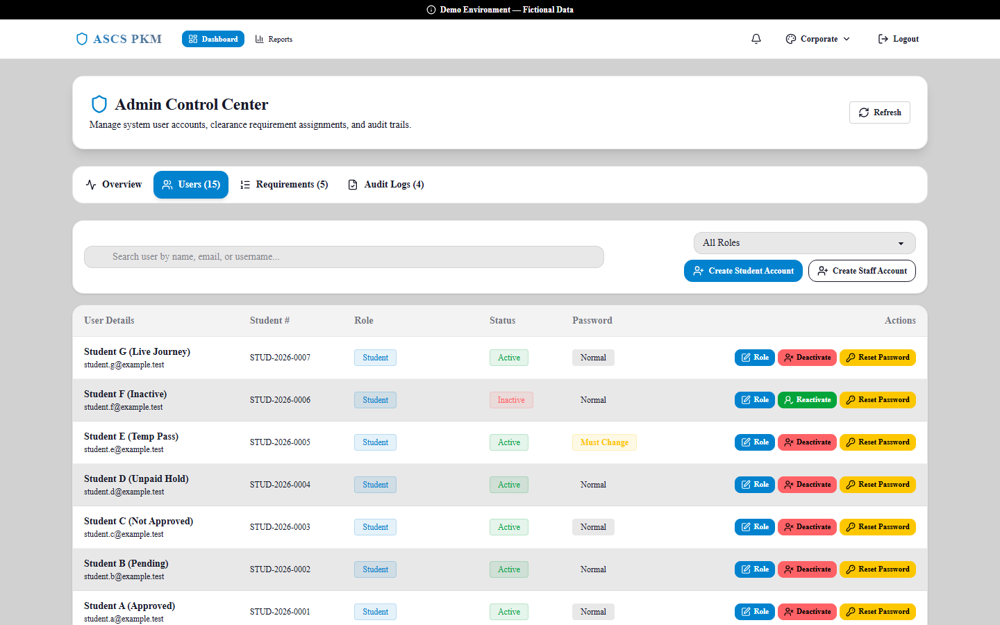

Route: `/admin/dashboard`
Role: System Administrator
Fixture: Users tab
Theme: Corporate
Viewport: 1440x900
Purpose: Shows account lifecycle and role management controls.

## Admin Reports

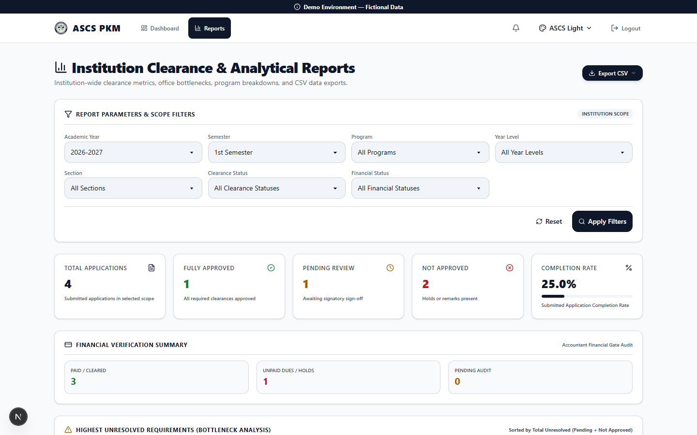

Route: `/admin/reports`
Role: System Administrator
Fixture: seeded 2026-2027, 1st Semester data
Theme: Corporate
Viewport: 1440x900
Purpose: Shows institution-wide metrics, normalized PKM program labels, and
financial summaries.

## Dean Reports

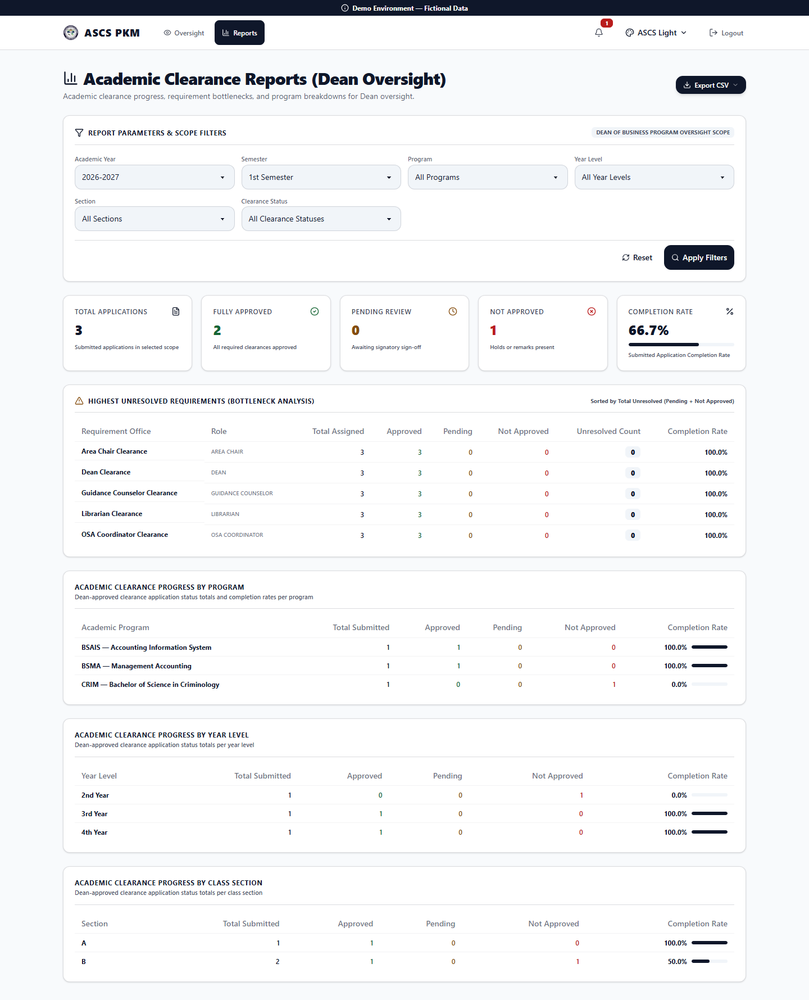

Route: `/dean/reports`
Role: Dean
Fixture: Dean-approved scope
Theme: Corporate
Viewport: 1440x900
Purpose: Shows normalized PKM program labels with the academic financial
privacy boundary.

## Printable Clearance Prototype

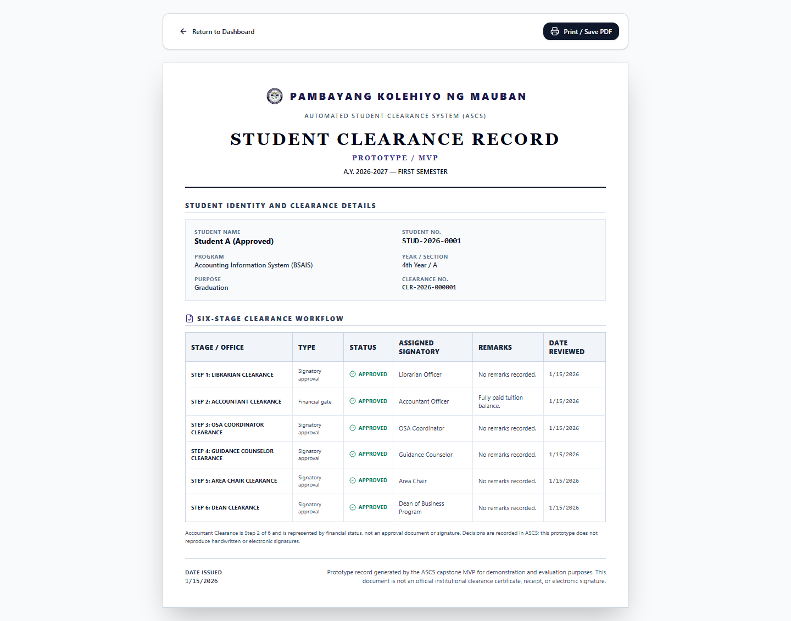

Route: `/student/clearance/app-student-a/print`
Role: Student
Fixture: Student A approved + paid (BSAIS - Accounting Information System)
Theme: Corporate / print layout
Viewport: 1440px wide, full-page (base viewport 1440x900)
Purpose: Shows the A4-oriented, PKM-slip-inspired digital prototype record with
the normalized Accounting Information System (BSAIS) display and six ordered
workflow rows, including the Step 2 Accountant financial gate. It contains no
reproduced signatures and is not an official certificate.

## Not-approved Student View

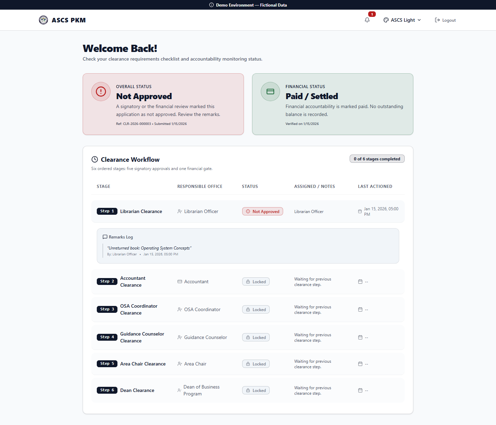

Route: `/student/dashboard`
Role: Student
Fixture: Student C (BEED - Bachelor of Elementary Education) with Librarian rejection remark
Theme: Corporate
Viewport: 1440px wide, full-page (base viewport 1440x900)
Purpose: Shows visible remarks and blocked printability.
